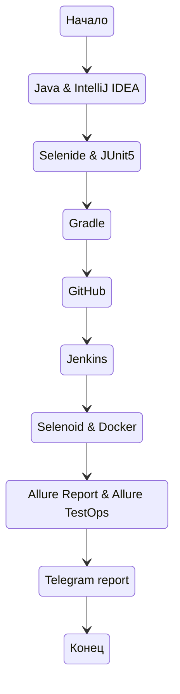
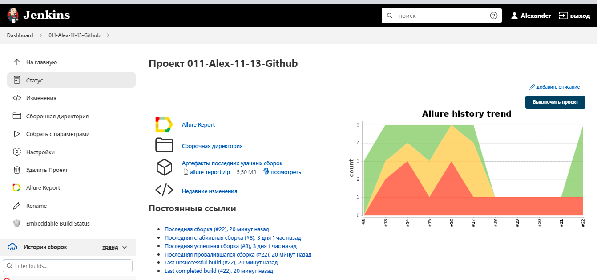
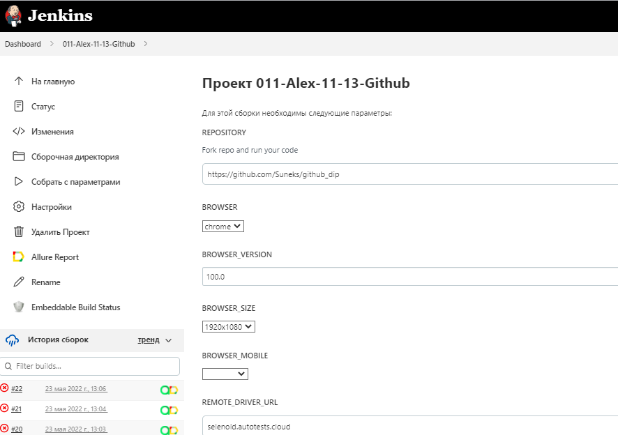
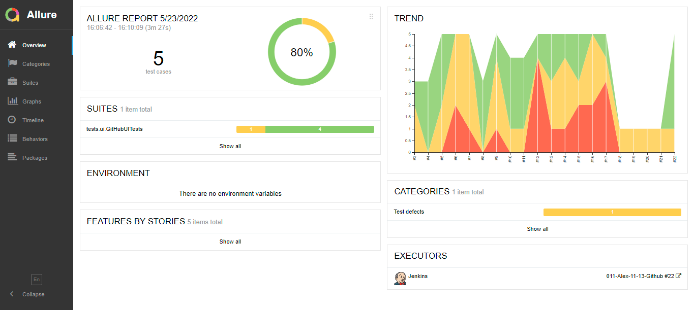
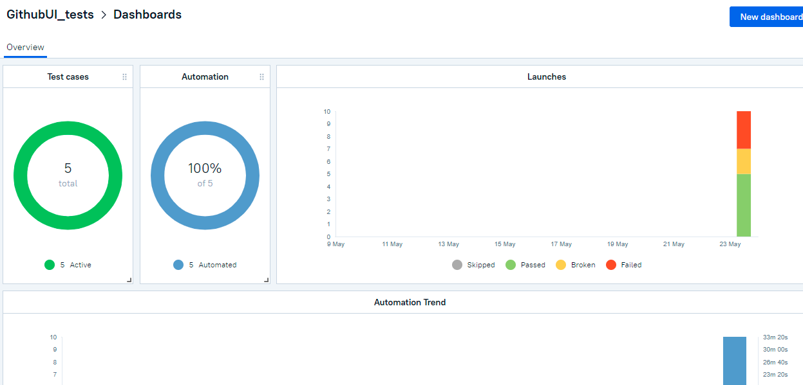
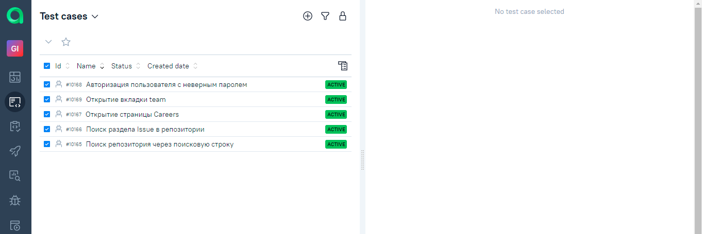
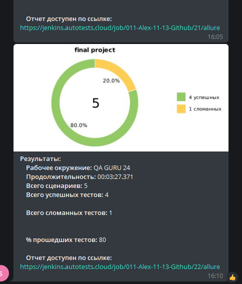

# Автотесты UI на http://github.com 🚀👨‍💻🚀

## Содержание:

1. [Технологии и инструменты](#технологии)
2. [Реализованные проверки](#описание)
3. [Запуск тестов](#запуск_тестов)
4. [Сборка в Jenkins](#дженкинс)
5. [Отчёт в Allure Report](#аллюр)
6. [Главный экран отчета Allure TestOps](#аллюр_тестопс)
7. [Интерграция с Jira](#джира)
8. [Видео о прохождении теста](#видео)
9. [Уведомления в Telegram](#телеграм)

<a name="технологии"></a>
Технологии и инструменты


IntelliJ IDEA, Java, Selenide, Selenoid, Gradle, JUnit5, Allure Report, Allure TestOps, Github, Jenkins, Telegram (reports), Jira



<a name="описание"></a>
## Реализованы проверки:
- [X] - Авторизация пользователя с неверным паролем
- [X] - Поиск репозитория через поисковую строку
- [X] - Поиск раздела Issue в репозитории
- [X] - Открытие вкладки team
- [X] - Открытие страницы careers

<a name="запуск_тестов"></a>
### Команда для запуска из терминала
Локально должны быть заданы параметры в local.properies, app.properties
```
gradle clean test
```
Удаленный запуск:
```
clean
test
-Dbrowser=${BROWSER}
-DbrowserVersion=${BROWSER_VERSION}
-DbrowserSize=${BROWSER_SIZE}
-DbrowserMobileView="${BROWSER_MOBILE}"
-DremoteDriverUrl=https://${USER}:${PASSWORD}@${REMOTE_DRIVER_URL}/wd/hub/
-DvideoStorage=https://${REMOTE_DRIVER_URL}/video/
-Dthreads=${THREADS}
```
<a name="дженкинс"></a>
### Запуск в Jenkins
Статистика по запускам
https://jenkins.autotests.cloud/job/011-Alex-11-13-Github/

### Запуск с параметрами
https://jenkins.autotests.cloud/job/011-Alex-11-13-Github/


<a name="аллюр"></a>
### Отчёт в Allure Report


<a name="аллюр_тестопс"></a>
### Главный экран отчета Allure TestOps
Отображение кейсов и ланчей




<a name="джирас"></a>
### Интерграция с Jira
Отображение тест-кейсов и ланча


<a name="видео"></a>
### Видео о прохождении теста


<a name="телеграм"></a>
### Уведомления в Telegram

